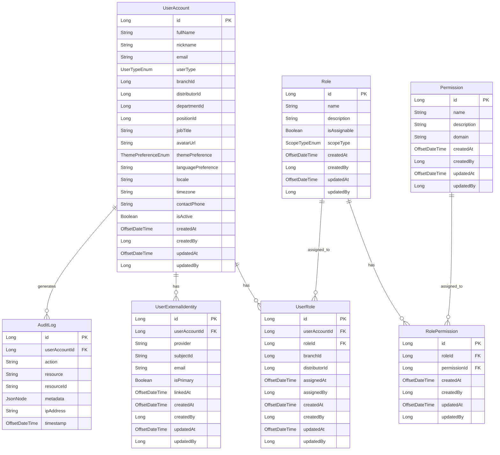

# Firefly Platform User Management Microservice

## Table of Contents
- [Overview](#overview)
- [Architecture](#architecture)
  - [Modules](#modules)
  - [Entity Relationship Diagram](#entity-relationship-diagram)
- [Features](#features)
- [Technologies](#technologies)
- [Getting Started](#getting-started)
  - [Prerequisites](#prerequisites)
  - [Installation](#installation)
  - [Configuration](#configuration)
- [API Documentation](#api-documentation)
  - [User Account API](#user-account-api)
  - [Role API](#role-api)
  - [Permission API](#permission-api)
  - [User Role API](#user-role-api)
  - [Role Permission API](#role-permission-api)
  - [User External Identity API](#user-external-identity-api)
  - [Audit Log API](#audit-log-api)
- [Usage Examples](#usage-examples)
- [Development](#development)
  - [Building the Project](#building-the-project)
  - [Running Tests](#running-tests)
- [Contributing](#contributing)
- [License](#license)

## Overview

The Firefly Platform User Management Microservice is a comprehensive solution for managing users, roles, and permissions in a distributed system. It provides a flexible and scalable approach to user management, authentication, and authorization.

This microservice is designed to be used as a core component of the Firefly Platform, providing centralized user management capabilities to other services and applications within the ecosystem.

## Architecture

The User Management Microservice follows a modular architecture, separating concerns into distinct modules for better maintainability and scalability.

### Modules

1. **common-platform-user-mgmt-interfaces**
   - Contains DTOs (Data Transfer Objects) and interfaces that define the contract between modules
   - Includes enums and other shared types used across the microservice

2. **common-platform-user-mgmt-models**
   - Contains entity classes that map to database tables
   - Defines the data model and relationships between entities
   - Includes repository interfaces for data access

3. **common-platform-user-mgmt-core**
   - Contains service interfaces and implementations
   - Implements the business logic of the microservice
   - Handles data validation, transformation, and processing

4. **common-platform-user-mgmt-web**
   - Provides RESTful API endpoints for interacting with the microservice
   - Handles HTTP requests and responses
   - Includes Swagger documentation for the API

5. **common-platform-user-mgmt-sdk**
   - Provides client libraries for other services to interact with the User Management Microservice
   - Simplifies integration with other components of the Firefly Platform

### Entity Relationship Diagram



## Features

- **User Management**: Create, read, update, and delete user accounts
- **Role-Based Access Control (RBAC)**: Assign roles to users and permissions to roles
- **External Identity Integration**: Link user accounts to external identity providers
- **Audit Logging**: Track changes to user accounts, roles, and permissions
- **Multi-Tenant Support**: Support for multiple organizations with branch and distributor hierarchies
- **Reactive API**: Non-blocking API using Spring WebFlux for high throughput
- **Comprehensive Documentation**: Swagger/OpenAPI documentation for all endpoints

## Technologies

- **Java 11+**: Core programming language
- **Spring Boot**: Application framework
- **Spring WebFlux**: Reactive web framework
- **Spring Data R2DBC**: Reactive database access
- **PostgreSQL**: Relational database
- **Maven**: Build and dependency management
- **Swagger/OpenAPI**: API documentation
- **Lombok**: Boilerplate code reduction
- **JUnit 5**: Testing framework

## Getting Started

### Prerequisites

- Java 11 or higher
- Maven 3.6 or higher
- PostgreSQL 12 or higher

### Installation

1. Clone the repository:
   ```bash
   git clone https://github.com/your-organization/common-platform-user-mgmt.git
   cd common-platform-user-mgmt
   ```

2. Build the project:
   ```bash
   mvn clean install
   ```

### Configuration

The application can be configured using the `application.yaml` file located in the `common-platform-user-mgmt-web/src/main/resources` directory.

Key configuration properties include:

- Database connection settings
- Server port and context path
- Logging configuration
- Security settings

Example configuration:

```yaml
spring:
  r2dbc:
    url: r2dbc:postgresql://localhost:5432/user_management
    username: postgres
    password: postgres

server:
  port: 8080

logging:
  level:
    root: INFO
    com.catalis.core.users: DEBUG
```

## API Documentation

The API is documented using Swagger/OpenAPI. When the application is running, you can access the Swagger UI at:

```
http://localhost:8080/swagger-ui.html
```

### User Account API

| Endpoint | Method | Description |
|----------|--------|-------------|
| `/api/v1/users` | POST | Create a new user account |
| `/api/v1/users/{userId}` | GET | Get a user account by ID |
| `/api/v1/users/{userId}` | PUT | Update a user account |
| `/api/v1/users/{userId}` | DELETE | Delete a user account |
| `/api/v1/users/filter` | POST | Filter user accounts with pagination |

### Role API

| Endpoint | Method | Description |
|----------|--------|-------------|
| `/api/v1/roles` | POST | Create a new role |
| `/api/v1/roles/{roleId}` | GET | Get a role by ID |
| `/api/v1/roles/{roleId}` | PUT | Update a role |
| `/api/v1/roles/{roleId}` | DELETE | Delete a role |
| `/api/v1/roles/filter` | POST | Filter roles with pagination |

### Permission API

| Endpoint | Method | Description |
|----------|--------|-------------|
| `/api/v1/permissions` | POST | Create a new permission |
| `/api/v1/permissions/{permissionId}` | GET | Get a permission by ID |
| `/api/v1/permissions/{permissionId}` | PUT | Update a permission |
| `/api/v1/permissions/{permissionId}` | DELETE | Delete a permission |
| `/api/v1/permissions/filter` | POST | Filter permissions with pagination |

### User Role API

| Endpoint | Method | Description |
|----------|--------|-------------|
| `/api/v1/user-roles` | POST | Assign a role to a user |
| `/api/v1/user-roles/{userRoleId}` | GET | Get a user-role assignment by ID |
| `/api/v1/user-roles/{userRoleId}` | DELETE | Remove a role from a user |
| `/api/v1/user-roles/filter` | POST | Filter user-role assignments with pagination |
| `/api/v1/user-roles/user/{userId}` | GET | Get all roles for a user |

### Role Permission API

| Endpoint | Method | Description |
|----------|--------|-------------|
| `/api/v1/role-permissions` | POST | Assign a permission to a role |
| `/api/v1/role-permissions/{rolePermissionId}` | GET | Get a role-permission assignment by ID |
| `/api/v1/role-permissions/{rolePermissionId}` | DELETE | Remove a permission from a role |
| `/api/v1/role-permissions/filter` | POST | Filter role-permission assignments with pagination |
| `/api/v1/role-permissions/role/{roleId}` | GET | Get all permissions for a role |

### User External Identity API

| Endpoint | Method | Description |
|----------|--------|-------------|
| `/api/v1/user-external-identities` | POST | Link an external identity to a user |
| `/api/v1/user-external-identities/{identityId}` | GET | Get an external identity by ID |
| `/api/v1/user-external-identities/{identityId}` | DELETE | Unlink an external identity from a user |
| `/api/v1/user-external-identities/filter` | POST | Filter external identities with pagination |
| `/api/v1/user-external-identities/user/{userId}` | GET | Get all external identities for a user |

### Audit Log API

| Endpoint | Method | Description |
|----------|--------|-------------|
| `/api/v1/audit-logs/{logId}` | GET | Get an audit log entry by ID |
| `/api/v1/audit-logs/filter` | POST | Filter audit log entries with pagination |
| `/api/v1/audit-logs/user/{userId}` | GET | Get all audit log entries for a user |

## Usage Examples

This section provides comprehensive examples of how to use the User Management Microservice API. Examples are provided for both the SDK and direct REST API calls.

### Quick Start Guide

#### 1. Setup the SDK Client

```java
// Initialize the SDK client
UserManagementClient client = new UserManagementClient("http://localhost:8080");
```

#### 2. User Management Workflow

The following examples demonstrate a complete user management workflow:

1. Create users
2. Create roles and permissions
3. Assign roles to users
4. Assign permissions to roles
5. Check user permissions
6. Query and filter data

### User Account API Examples

#### Creating a User Account

**Using the SDK:**

```java
// Create a new user account
UserAccountDTO newUser = UserAccountDTO.builder()
    .fullName("John Doe")
    .nickname("Johnny")
    .email("john.doe@example.com")
    .userType(UserTypeEnum.EMPLOYEE)
    .branchId(1L)
    .distributorId(1L)
    .departmentId(2L)
    .positionId(3L)
    .jobTitle("Software Engineer")
    .themePreference(ThemePreferenceEnum.DARK)
    .languagePreference("en-US")
    .locale("en_US")
    .timezone("America/New_York")
    .contactPhone("+1-555-123-4567")
    .isActive(true)
    .build();

UserAccountDTO createdUser = client.createUserAccount(newUser).block();
System.out.println("Created user with ID: " + createdUser.getId());
```

**Using REST API (curl):**

```bash
curl -X POST http://localhost:8080/api/v1/users \
  -H "Content-Type: application/json" \
  -d '{
    "fullName": "John Doe",
    "nickname": "Johnny",
    "email": "john.doe@example.com",
    "userType": "EMPLOYEE",
    "branchId": 1,
    "distributorId": 1,
    "departmentId": 2,
    "positionId": 3,
    "jobTitle": "Software Engineer",
    "themePreference": "DARK",
    "languagePreference": "en-US",
    "locale": "en_US",
    "timezone": "America/New_York",
    "contactPhone": "+1-555-123-4567",
    "isActive": true
  }'
```

#### Retrieving a User Account

**Using the SDK:**

```java
// Get user by ID
Long userId = 1L;
UserAccountDTO user = client.getUserAccountById(userId).block();
System.out.println("Retrieved user: " + user.getFullName());
```

**Using REST API (curl):**

```bash
curl -X GET http://localhost:8080/api/v1/users/1
```

#### Updating a User Account

**Using the SDK:**

```java
// Update an existing user
UserAccountDTO userToUpdate = client.getUserAccountById(1L).block();
userToUpdate.setFullName("John Smith");
userToUpdate.setJobTitle("Senior Software Engineer");

UserAccountDTO updatedUser = client.updateUserAccount(userToUpdate.getId(), userToUpdate).block();
System.out.println("Updated user: " + updatedUser.getFullName());
```

**Using REST API (curl):**

```bash
curl -X PUT http://localhost:8080/api/v1/users/1 \
  -H "Content-Type: application/json" \
  -d '{
    "fullName": "John Smith",
    "nickname": "Johnny",
    "email": "john.doe@example.com",
    "jobTitle": "Senior Software Engineer",
    "isActive": true
  }'
```

#### Filtering User Accounts

**Using the SDK:**

```java
// Filter users by criteria
FilterRequest<UserAccountDTO> filterRequest = new FilterRequest<>();
filterRequest.setFilter(UserAccountDTO.builder()
    .userType(UserTypeEnum.EMPLOYEE)
    .branchId(1L)
    .build());
filterRequest.setPage(0);
filterRequest.setSize(10);

PaginationResponse<UserAccountDTO> users = client.filterUserAccounts(filterRequest).block();
System.out.println("Found " + users.getTotalElements() + " users");
users.getContent().forEach(u -> System.out.println(u.getFullName()));
```

**Using REST API (curl):**

```bash
curl -X POST http://localhost:8080/api/v1/users/filter \
  -H "Content-Type: application/json" \
  -d '{
    "filter": {
      "userType": "EMPLOYEE",
      "branchId": 1
    },
    "page": 0,
    "size": 10
  }'
```

### Role API Examples

#### Creating a Role

**Using the SDK:**

```java
// Create a new role
RoleDTO newRole = RoleDTO.builder()
    .name("Admin")
    .description("Administrator role with full access")
    .isAssignable(true)
    .scopeType(ScopeTypeEnum.GLOBAL)
    .build();

RoleDTO createdRole = client.createRole(newRole).block();
System.out.println("Created role with ID: " + createdRole.getId());
```

**Using REST API (curl):**

```bash
curl -X POST http://localhost:8080/api/v1/roles \
  -H "Content-Type: application/json" \
  -d '{
    "name": "Admin",
    "description": "Administrator role with full access",
    "isAssignable": true,
    "scopeType": "GLOBAL"
  }'
```

#### Retrieving a Role

**Using the SDK:**

```java
// Get role by ID
Long roleId = 1L;
RoleDTO role = client.getRoleById(roleId).block();
System.out.println("Retrieved role: " + role.getName());
```

**Using REST API (curl):**

```bash
curl -X GET http://localhost:8080/api/v1/roles/1
```

#### Filtering Roles

**Using the SDK:**

```java
// Filter roles by criteria
FilterRequest<RoleDTO> filterRequest = new FilterRequest<>();
filterRequest.setFilter(RoleDTO.builder()
    .scopeType(ScopeTypeEnum.GLOBAL)
    .build());
filterRequest.setPage(0);
filterRequest.setSize(10);

PaginationResponse<RoleDTO> roles = client.filterRoles(filterRequest).block();
System.out.println("Found " + roles.getTotalElements() + " roles");
roles.getContent().forEach(r -> System.out.println(r.getName()));
```

**Using REST API (curl):**

```bash
curl -X POST http://localhost:8080/api/v1/roles/filter \
  -H "Content-Type: application/json" \
  -d '{
    "filter": {
      "scopeType": "GLOBAL"
    },
    "page": 0,
    "size": 10
  }'
```

### Permission API Examples

#### Creating a Permission

**Using the SDK:**

```java
// Create a new permission
PermissionDTO newPermission = PermissionDTO.builder()
    .name("user:create")
    .description("Permission to create users")
    .domain("user-management")
    .build();

PermissionDTO createdPermission = client.createPermission(newPermission).block();
System.out.println("Created permission with ID: " + createdPermission.getId());
```

**Using REST API (curl):**

```bash
curl -X POST http://localhost:8080/api/v1/permissions \
  -H "Content-Type: application/json" \
  -d '{
    "name": "user:create",
    "description": "Permission to create users",
    "domain": "user-management"
  }'
```

#### Retrieving a Permission

**Using the SDK:**

```java
// Get permission by ID
Long permissionId = 1L;
PermissionDTO permission = client.getPermissionById(permissionId).block();
System.out.println("Retrieved permission: " + permission.getName());
```

**Using REST API (curl):**

```bash
curl -X GET http://localhost:8080/api/v1/permissions/1
```

#### Filtering Permissions

**Using the SDK:**

```java
// Filter permissions by criteria
FilterRequest<PermissionDTO> filterRequest = new FilterRequest<>();
filterRequest.setFilter(PermissionDTO.builder()
    .domain("user-management")
    .build());
filterRequest.setPage(0);
filterRequest.setSize(10);

PaginationResponse<PermissionDTO> permissions = client.filterPermissions(filterRequest).block();
System.out.println("Found " + permissions.getTotalElements() + " permissions");
permissions.getContent().forEach(p -> System.out.println(p.getName()));
```

**Using REST API (curl):**

```bash
curl -X POST http://localhost:8080/api/v1/permissions/filter \
  -H "Content-Type: application/json" \
  -d '{
    "filter": {
      "domain": "user-management"
    },
    "page": 0,
    "size": 10
  }'
```

### User Role API Examples

#### Assigning a Role to a User

**Using the SDK:**

```java
// Assign a role to a user
UserRoleDTO userRole = UserRoleDTO.builder()
    .userAccountId(1L)
    .roleId(1L)
    .branchId(1L)
    .distributorId(1L)
    .build();

UserRoleDTO assignedRole = client.assignRoleToUser(userRole).block();
System.out.println("Assigned role ID " + assignedRole.getRoleId() + " to user ID " + assignedRole.getUserAccountId());
```

**Using REST API (curl):**

```bash
curl -X POST http://localhost:8080/api/v1/user-roles \
  -H "Content-Type: application/json" \
  -d '{
    "userAccountId": 1,
    "roleId": 1,
    "branchId": 1,
    "distributorId": 1
  }'
```

#### Getting Roles for a User

**Using the SDK:**

```java
// Get all roles for a user
Long userId = 1L;
List<UserRoleDTO> userRoles = client.getRolesByUserId(userId).block().getContent();
System.out.println("User has " + userRoles.size() + " roles");
userRoles.forEach(ur -> System.out.println("Role ID: " + ur.getRoleId()));
```

**Using REST API (curl):**

```bash
curl -X GET http://localhost:8080/api/v1/user-roles/user/1
```

#### Removing a Role from a User

**Using the SDK:**

```java
// Remove a role from a user
Long userRoleId = 1L;
client.removeRoleFromUser(userRoleId).block();
System.out.println("Removed user-role with ID: " + userRoleId);
```

**Using REST API (curl):**

```bash
curl -X DELETE http://localhost:8080/api/v1/user-roles/1
```

### Role Permission API Examples

#### Assigning a Permission to a Role

**Using the SDK:**

```java
// Assign a permission to a role
RolePermissionDTO rolePermission = RolePermissionDTO.builder()
    .roleId(1L)
    .permissionId(1L)
    .build();

RolePermissionDTO assignedPermission = client.assignPermissionToRole(rolePermission).block();
System.out.println("Assigned permission ID " + assignedPermission.getPermissionId() + " to role ID " + assignedPermission.getRoleId());
```

**Using REST API (curl):**

```bash
curl -X POST http://localhost:8080/api/v1/role-permissions \
  -H "Content-Type: application/json" \
  -d '{
    "roleId": 1,
    "permissionId": 1
  }'
```

#### Getting Permissions for a Role

**Using the SDK:**

```java
// Get all permissions for a role
Long roleId = 1L;
List<RolePermissionDTO> rolePermissions = client.getPermissionsByRoleId(roleId).block().getContent();
System.out.println("Role has " + rolePermissions.size() + " permissions");
rolePermissions.forEach(rp -> System.out.println("Permission ID: " + rp.getPermissionId()));
```

**Using REST API (curl):**

```bash
curl -X GET http://localhost:8080/api/v1/role-permissions/role/1
```

#### Removing a Permission from a Role

**Using the SDK:**

```java
// Remove a permission from a role
Long rolePermissionId = 1L;
client.removePermissionFromRole(rolePermissionId).block();
System.out.println("Removed role-permission with ID: " + rolePermissionId);
```

**Using REST API (curl):**

```bash
curl -X DELETE http://localhost:8080/api/v1/role-permissions/1
```

### User External Identity API Examples

#### Linking an External Identity to a User

**Using the SDK:**

```java
// Link an external identity to a user
UserExternalIdentityDTO externalIdentity = UserExternalIdentityDTO.builder()
    .userAccountId(1L)
    .provider("GOOGLE")
    .subjectId("google-subject-id-123")
    .email("john.doe@gmail.com")
    .isPrimary(true)
    .build();

UserExternalIdentityDTO linkedIdentity = client.linkExternalIdentityToUser(externalIdentity).block();
System.out.println("Linked external identity with ID: " + linkedIdentity.getId());
```

**Using REST API (curl):**

```bash
curl -X POST http://localhost:8080/api/v1/user-external-identities \
  -H "Content-Type: application/json" \
  -d '{
    "userAccountId": 1,
    "provider": "GOOGLE",
    "subjectId": "google-subject-id-123",
    "email": "john.doe@gmail.com",
    "isPrimary": true
  }'
```

#### Getting External Identities for a User

**Using the SDK:**

```java
// Get all external identities for a user
Long userId = 1L;
List<UserExternalIdentityDTO> externalIdentities = client.getExternalIdentitiesByUserId(userId).block().getContent();
System.out.println("User has " + externalIdentities.size() + " external identities");
externalIdentities.forEach(ei -> System.out.println("Provider: " + ei.getProvider()));
```

**Using REST API (curl):**

```bash
curl -X GET http://localhost:8080/api/v1/user-external-identities/user/1
```

#### Unlinking an External Identity from a User

**Using the SDK:**

```java
// Unlink an external identity from a user
Long externalIdentityId = 1L;
client.unlinkExternalIdentityFromUser(externalIdentityId).block();
System.out.println("Unlinked external identity with ID: " + externalIdentityId);
```

**Using REST API (curl):**

```bash
curl -X DELETE http://localhost:8080/api/v1/user-external-identities/1
```

### Audit Log API Examples

#### Retrieving Audit Logs

**Using the SDK:**

```java
// Get audit logs for a user
Long userId = 1L;
List<AuditLogDTO> auditLogs = client.getAuditLogsByUserId(userId).block().getContent();
System.out.println("Found " + auditLogs.size() + " audit logs for user");
auditLogs.forEach(log -> System.out.println("Action: " + log.getAction() + ", Resource: " + log.getResource()));
```

**Using REST API (curl):**

```bash
curl -X GET http://localhost:8080/api/v1/audit-logs/user/1
```

#### Filtering Audit Logs

**Using the SDK:**

```java
// Filter audit logs by criteria
FilterRequest<AuditLogDTO> filterRequest = new FilterRequest<>();
filterRequest.setFilter(AuditLogDTO.builder()
    .resource("user_account")
    .action("CREATE")
    .build());
filterRequest.setPage(0);
filterRequest.setSize(10);

PaginationResponse<AuditLogDTO> auditLogs = client.filterAuditLogs(filterRequest).block();
System.out.println("Found " + auditLogs.getTotalElements() + " audit logs");
auditLogs.getContent().forEach(log -> {
    System.out.println("User ID: " + log.getUserAccountId());
    System.out.println("Action: " + log.getAction());
    System.out.println("Resource: " + log.getResource());
    System.out.println("Timestamp: " + log.getTimestamp());
});
```

**Using REST API (curl):**

```bash
curl -X POST http://localhost:8080/api/v1/audit-logs/filter \
  -H "Content-Type: application/json" \
  -d '{
    "filter": {
      "resource": "user_account",
      "action": "CREATE"
    },
    "page": 0,
    "size": 10
  }'
```

### Complete Workflow Example

The following example demonstrates a complete workflow for setting up a user with roles and permissions:

```java
// Initialize the client
UserManagementClient client = new UserManagementClient("http://localhost:8080");

// 1. Create a new user
UserAccountDTO newUser = UserAccountDTO.builder()
    .fullName("Jane Smith")
    .email("jane.smith@example.com")
    .userType(UserTypeEnum.EMPLOYEE)
    .isActive(true)
    .build();
UserAccountDTO user = client.createUserAccount(newUser).block();

// 2. Create a new role
RoleDTO newRole = RoleDTO.builder()
    .name("Sales Manager")
    .description("Role for sales managers")
    .isAssignable(true)
    .scopeType(ScopeTypeEnum.BRANCH)
    .build();
RoleDTO role = client.createRole(newRole).block();

// 3. Create permissions
PermissionDTO viewCustomersPermission = PermissionDTO.builder()
    .name("customer:view")
    .description("Permission to view customers")
    .domain("sales")
    .build();
PermissionDTO createOrdersPermission = PermissionDTO.builder()
    .name("order:create")
    .description("Permission to create orders")
    .domain("sales")
    .build();

PermissionDTO permission1 = client.createPermission(viewCustomersPermission).block();
PermissionDTO permission2 = client.createPermission(createOrdersPermission).block();

// 4. Assign role to user
UserRoleDTO userRole = UserRoleDTO.builder()
    .userAccountId(user.getId())
    .roleId(role.getId())
    .branchId(1L)
    .build();
client.assignRoleToUser(userRole).block();

// 5. Assign permissions to role
RolePermissionDTO rolePermission1 = RolePermissionDTO.builder()
    .roleId(role.getId())
    .permissionId(permission1.getId())
    .build();
RolePermissionDTO rolePermission2 = RolePermissionDTO.builder()
    .roleId(role.getId())
    .permissionId(permission2.getId())
    .build();

client.assignPermissionToRole(rolePermission1).block();
client.assignPermissionToRole(rolePermission2).block();

// 6. Check if user has permission
boolean canViewCustomers = client.hasPermission(user.getId(), "customer:view").block();
boolean canCreateOrders = client.hasPermission(user.getId(), "order:create").block();

System.out.println("User can view customers: " + canViewCustomers);
System.out.println("User can create orders: " + canCreateOrders);

// 7. Get all roles for the user
List<UserRoleDTO> userRoles = client.getRolesByUserId(user.getId()).block().getContent();
System.out.println("User has " + userRoles.size() + " roles");

// 8. Get all permissions for a role
List<RolePermissionDTO> rolePermissions = client.getPermissionsByRoleId(role.getId()).block().getContent();
System.out.println("Role has " + rolePermissions.size() + " permissions");
```

## Development

### Building the Project

To build the project, run:

```bash
mvn clean install
```

This will compile the code, run tests, and package the application.

### Running Tests

To run the tests, use:

```bash
mvn test
```

For integration tests:

```bash
mvn verify
```

## Contributing

1. Fork the repository
2. Create a feature branch (`git checkout -b feature/your-feature`)
3. Commit your changes (`git commit -m 'Add some feature'`)
4. Push to the branch (`git push origin feature/your-feature`)
5. Open a Pull Request

## License

This project is licensed under the [LICENSE] - see the LICENSE file for details.
